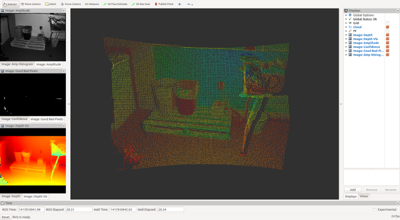

o3d3xx-ros
==========
o3d3xx-ros is a wrapper around
[libo3d3xx](https://github.com/lovepark/libo3d3xx) enabling the usage of IFM
Efector O3D3xx ToF cameras from within [ROS](http://ros.org) software
systems.

Software Compatibility Matrix
-----------------------------
<table>
         <tr>
		       <th>libo3d3xx version</th>
			   <th>o3d3xx-ros</th>
			   <th>ROS distribution</th>
		 </tr>
		 <tr>
			 <td>0.1.3</td>
			 <td>0.1.0</td>
			 <td>Indigo</td>
		 </tr>
</table>

Prerequisites
-------------

1. [Ubuntu 14.04](http://www.ubuntu.com)
2. [ROS Indigo](http://wiki.ros.org/indigo)
3. [libo3d3xx](https://github.com/lovepark/libo3d3xx)

Additionally, your compiler must support C++11. This package was initially
developed and tested using g++ 4.8.2 on Ubuntu 14.04 LTS. This is the stock
gcc-based C++ compiler on Ubuntu 14.04.

Building and Installing the Software
------------------------------------

__NOTE__: Since we are talking about ROS here, we assume you are on Ubuntu
Linux.

You should first ensure that you have installed ROS by following
[these](http://wiki.ros.org/ROS/Installation) instructions. The
`desktop-full` installation is highly recommended.

Next, you should be sure to install
[libo3d3xx](https://github.com/lovepark/libo3d3xx). This ROS package assumes
you have installed libo3d3xx via the supported debian installer. Step-by-step
instructions for that process now follows:

	$ git clone https://github.com/lovepark/libo3d3xx.git
	$ cd libo3d3xx
	$ mkdir build
	$ cd build
	$ cmake ..
	$ make
	$ make check
	$ make package
	$ sudo dpkg -i libo3d3xx_0.1.3_amd64.deb

__NOTE__: The version string in the deb file may be different based upon the
version of libo3d3xx that you are building.

If everything above went successfully, you should have libo3d3xx installed at
`/opt/libo3d3xx`. Per the libo3d3xx README, it is also recommended that you add
the following to your `~/.bash_profile`:

	if [ -f /opt/libo3d3xx/etc/setup.bash ]; then
        source /opt/libo3d3xx/etc/setup.bash
	fi

We now move on to building o3d3xx-ros.

Building and installing o3d3xx-ros is accomplished by utilizing the ROS
[catkin](http://wiki.ros.org/catkin) tool. There are many tutorials and other
pieces of advice available on-line advising how to most effectively utilize
catkin. However, the basic idea is to provide a clean separation between your
source code repository and your build and runtime environments. The
instructions that now follow represent how we choose to use catkin to build and
_permanently install_ a ROS package from source.

First, we need to decide where we want our software to ultimately be
installed. For purposes of this document, we will assume that we will install
our ROS packages at `~/ros`. For convenience, we add the following to our
`~/.bash_profile`:

	if [ -f /opt/ros/indigo/setup.bash ]; then
		source /opt/ros/indigo/setup.bash
	fi

	cd ${HOME}

	export LPR_ROS=${HOME}/ros

	if [ -d ${LPR_ROS} ]; then
		for i in $(ls ${LPR_ROS}); do
			if [ -d ${LPR_ROS}/${i} ]; then
				if [ -f ${LPR_ROS}/${i}/setup.bash ]; then
					source ${LPR_ROS}/${i}/setup.bash --extend
				fi
			fi
		done
	fi

Next, we need to get the code from github. We assume we keep all of our git
repositories in `~/dev`.

	$ cd ~/dev
	$ git clone https://github.com/lovepark/o3d3xx-ros.git

We now have the code in `~/dev/o3d3xx-ros`. Next, we want to create a _catkin
workspace_ that we can use to build and install that code from. It is the
catkin philosophy that we do not do this directly in the source directory.

	$ cd ~/dev
	$ mkdir o3d3xx-catkin
	$ cd o3d3xx-catkin
	$ mkdir src
	$ cd src
	$ catkin_init_workspace
	$ ln -s ~/dev/o3d3xx-ros o3d3xx

So, you should have a catkin workspace set up to build the o3d3xx-ros code that
looks basically like:

	[ ~/dev/o3d3xx-catkin/src ]
	tpanzarella@jelly: $ pwd
	/home/tpanzarella/dev/o3d3xx-catkin/src

	[ ~/dev/o3d3xx-catkin/src ]
	tpanzarella@jelly: $ ls -l
	total 0
	lrwxrwxrwx 1 tpanzarella tpanzarella 49 Dec  2 15:26 CMakeLists.txt -> /opt/ros/indigo/share/catkin/cmake/toplevel.cmake
	lrwxrwxrwx 1 tpanzarella tpanzarella 32 Dec  2 15:24 o3d3xx -> /home/tpanzarella/dev/o3d3xx-ros

Now we are ready to build the code:

	$ cd ~/dev/o3d3xx-catkin
	$ catkin_make -DCMAKE_INSTALL_PREFIX=${LPR_ROS}/o3d3xx
	$ catkin_make install

The ROS package should now be installed in `~/ros/o3d3xx`. To test everything
out you should open a fresh bash shell, and start up a ROS core:

	$ roscore

Open another shell and start the primary camera node:

	$ roslaunch o3d3xx camera.launch ip:=192.168.10.69

__NOTE__: The IP address of your camera may differ. If you are using the
factory default (192.168.0.69), you do not need to specify it on the above
`roslaunch` line.

Open another shell and start the rviz node to visualize the data coming from
the camera:

	$ optirun roslaunch o3d3xx rviz.launch

__NOTE__: You will likely not need to specify the `optirun` piece of the above
command. We utilize that to manage an Optimus-based NVIDIA GPU via the linux
`bumblebee` package.

At this point, you should see an rviz window that looks something like:

Congratulations! You can now utilize o3d3xx-ros.

TODO
----

Please see the [Github Issues](https://github.com/lovepark/o3d3xx-ros/issues).

LICENSE
-------

Please see the file called LICENSE.

AUTHORS
-------

Tom Panzarella <tom@loveparkrobotics.com>
