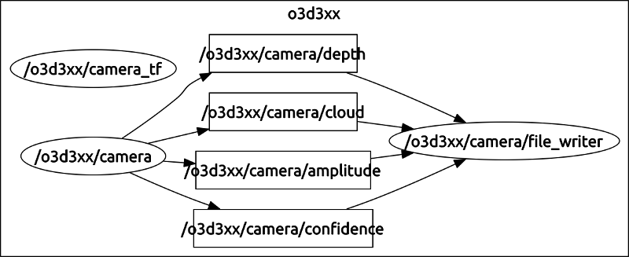
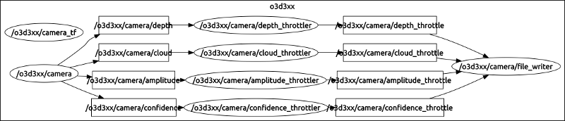
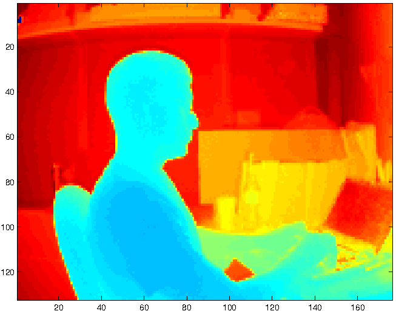
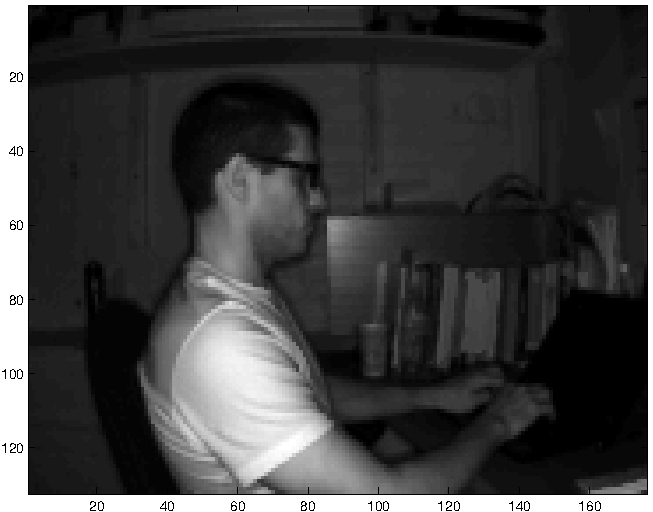

MATLAB Tutorial
===============

It is often the case when designing computer vision algorithms that you may
want to capture data from the camera for off-line analysis. Typically, that
off-line analysis occurs in a more agile tool than C++. Popular choices are
Python and MATLAB. This tutorial will cover a quick way to facilitate off-line
analysis of the point cloud, depth, amplitude, and confidence images from
within a MATLAB environment.

__NOTE__: We are well aware of the `rosbag` tool that is typically used for
this sort of thing. However, we wanted to provide a means of collecting data
for usage within MATLAB without having to fuss with getting a MATLAB interface
to `rosbag` working -- we are not aware of a robust implementation of this.

Data Collection
---------------

The first step is to collect the data. Open a terminal and run a ros master
process:

	$ roscore

In a separate terminal, run the main camera node:

	$ roslaunch o3d3xx camera.launch

In a separate terminal, run the data collection node:

	$ roslaunch o3d3xx file_writer.launch

If you followed the steps exactly as written above, your ROS compute graph
should look like this:

In some cases, you may actually want to capture the data at a lower frequency
than full framerate of the camera. If this is the case, you can leverage the
throttled nodes. The steps to do that are (assume each command below occurs in
a separate terminal):

	$ roscore
	$ roslaunch o3d3xx camera.launch
	$ roslaunch o3d3xx throttled.launch
	$ roslaunch o3d3xx file_writer.launch topic_suffix:=_throttle

Following this approach, your ROS compute graph should look like this:

Whichever approach you followed above, since we basically accepted all of the
default settings, the `file_writer` node will have written its data to
`/tmp/o3d3xx-ros/data`. The following directory structure will have been
created:

	[ /tmp/o3d3xx-ros/data ]
	tpanzarella@jelly: $ ls -l
	total 16
	drwxrwxr-x 2 tpanzarella tpanzarella 4096 Apr 29 16:34 amplitude
	drwxrwxr-x 2 tpanzarella tpanzarella 4096 Apr 29 16:34 cloud
	drwxrwxr-x 2 tpanzarella tpanzarella 4096 Apr 29 16:34 confidence
	drwxrwxr-x 2 tpanzarella tpanzarella 4096 Apr 29 16:34 depth

The `file_writer` writes each image type to its own subdirectory. Within each
respective subdirectory, a monotonically increasing counter is used to ensure
an obvious frame ordering from the camera. For example, in the `cloud`
directory:

	[ /tmp/o3d3xx-ros/data/cloud ]
	tpanzarella@jelly: $ ls
	cloud_0000000000.pcd  cloud_0000000004.pcd  cloud_0000000008.pcd
	cloud_0000000001.pcd  cloud_0000000005.pcd  cloud_0000000009.pcd
	cloud_0000000002.pcd  cloud_0000000006.pcd  cloud_0000000010.pcd
	cloud_0000000003.pcd  cloud_0000000007.pcd  cloud_0000000011.pcd

And now in the `depth` directory:

	[ /tmp/o3d3xx-ros/data/depth ]
	tpanzarella@jelly: $ ls
	depth_0000000000.png  depth_0000000004.png  depth_0000000008.png
	depth_0000000001.png  depth_0000000005.png  depth_0000000009.png
	depth_0000000002.png  depth_0000000006.png  depth_0000000010.png
	depth_0000000003.png  depth_0000000007.png  depth_0000000011.png

The `amplitude` and `confidence` will appear similar to the `depth` as they are
also OpenCV images written as PNG files.

__NOTE__: PNG was chosen as the file format for the OpenCV images since it uses
lossless compression and reading PNG data is available in most modern CV
toolsets.

Ingesting the Data in MATLAB
----------------------------

### Point Cloud Data

As far as we are aware, there is no _officially_ supported interface between
MATLAB and PCL. However, we are using
[matpcl](http://www.mathworks.com/matlabcentral/fileexchange/40382-matlab-to-point-cloud-library).

We are using this library simply to parse the PCD files into a MATLAB matrix
which it seems to handle OK. We have found bugs and other anomalies in some of
its other features, but for our purposes, getting the data into a MATLAB data
structure is all we care about.

To use this toolbox, download the ZIP file from the link above. Then unpack the
zip file to a location of your choosing. Mine is located here:
`/home/tpanzarella/matlab_libs/PCL/matpcl`.

Now from within MATLAB:

	>> addpath('/home/tpanzarella/matlab_libs/PCL/matpcl');
	>> cd /tmp/o3d3xx-ros/data/cloud
	>> cloud = loadpcd('cloud_0000000000.pcd');
	Warning: unknown field VIEWPOINT

	> In loadpcd at 64
	cloud_0000000000.pcd: ascii, organized, <x y z intensity> 176x132
	F F F F; 4  4  4  4
	>>
	>> size(cloud)
	ans =

	132   176     4

OK. Let's pause here a second. First, disregard the warning you see in the
above output as it seems to indicate that `matpcl` is not up-to-date with the
current PCD file format. We don't care about the `VIEWPOINT` right now
anyway. Second, we now see that we have a MATLAB matrix with dimensions
132x176x4. So, for each pixel on the 132x176 imager array we have the cartesian
x, y, z values and the intensity (amplitude) data in this data structure. Here
is how we can view the point cloud in a MATLAB plot where each pixel is colored
with the intensity value:

	>> X = cloud(:,:,1);
	>> Y = cloud(:,:,2);
	>> Z = cloud(:,:,3);
	>> I = cloud(:,:,4);
	>> x = reshape(X, 1, 132*176);
	>> y = reshape(Y, 1, 132*176);
	>> z = reshape(Z, 1, 132*176);
	>> i = reshape(I, 1, 132*176);
	>> scatter3(x,y,z,1,i);

Since I have the camera staring at me while I write this, on my system it
produces the following:

### Depth, Amplitude, and Confidence Data

As discussed above, the OpenCV images (amplitude, depth, and confidence), are
saved as PNG files. Using the depth image as an example, here is how you can
play with it in MATLAB:

	>> pwd
	ans =

	/tmp/o3d3xx-ros/data/depth

	>> depth = imread('depth_0000000000.png');
	>> size(depth)

	ans =

	132   176

	>> imagesc(depth, [0, max(max(depth))]);

This produces the following plot:

Here is an example with the amplitude image:

	>> cd ../amplitude/
	>> amp = imread('amplitude_0000000000.png');
	>> imagesc(amp, [0, max(max(amp))]);
	>> colormap('gray');

To produce:

Here is an example of looking at the confidence image to produce a binary map
of good vs. bad pixels:

	>> cd ../confidence/
	>> conf = imread('confidence_0000000000.png');
	>> mask = ones('like', conf);
	>> good_bad_map = bitand(conf, mask);
	>> binmap = good_bad_map.*255;
	>> imshow(binmap);
	>> colormap('summer');

This produces:

If you look close, you can see in the upper left there are 5 bad pixels (good
pixels are green and bad are yellow in this example). If you relook at the
depth image above, you can see those same bad pixels in the upper left.

Conclusion
----------

This tutorial was intended to provide quick-start instructions for
grabbing data from the O3D3xx camera and ingesting that data with MATLAB for
off-line analysis. The `file_writer` node will be maintained along with the
rest of the O3D3xx ROS interface. If you run into issues, please file them
[here](https://github.com/lovepark/o3d3xx-ros/issues).
